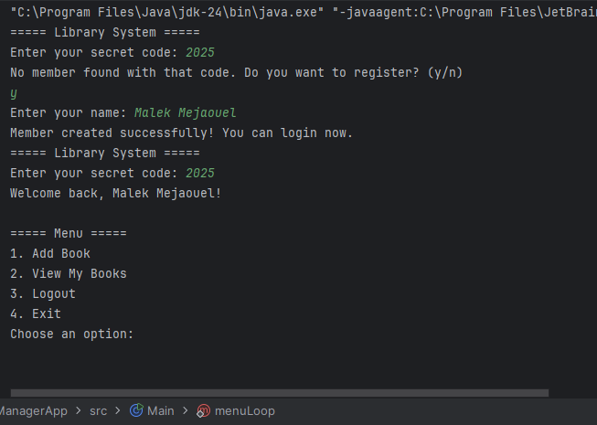
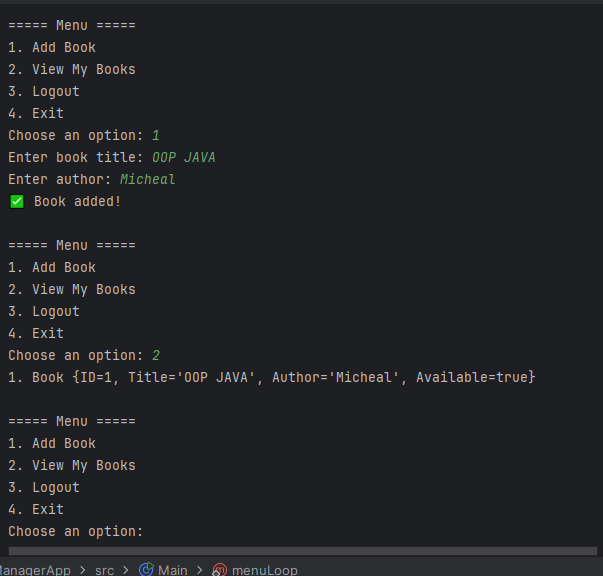

📚 Library Manager Project
📖 Overview

The Library Manager is a simple console-based application built in Java that demonstrates Object-Oriented Programming (OOP) concepts such as classes, objects, encapsulation, file handling, and modular design.

The program allows users (library members) to:

Login using a secret code.

Register new members (saved in a text file).

View available books.

Borrow or return books.

Save and load data from files for persistence.

This project will later be extended with a Graphical User Interface (GUI), but for now, it runs in the terminal/console.
## Screenshots

### Main Menu

🛠 Features

✅ Member Management

Save members to a text file.

Load members on program startup.

Login with a secret code.

✅ Book Management

Add, view, and remove books.

Borrow and return books.

Display book information with toString().

✅ File Handling

Persistent storage of members in members.txt.

Future extension: books storage.

✅ Menu System

Interactive console-based menu loop.

Options for login, register, view books, borrow, return, and logout.

🏗️ Project Structure
LibraryManager/
│── src/
│   ├── Main.java        # Entry point, menu system
│   ├── Book.java        # Book class
│   ├── Member.java      # Member class (file handling + login)
│── members.txt          # Saved members (auto-created if missing)
│── README.md            # Project documentation

🔑 How It Works

Start the Program → User is prompted to login with a secret code.

Login System

If the member exists in members.txt, they can proceed.

If not, they can register as a new member.

Main Menu → Options include:

View Books

Borrow Book

Return Book

Logout

Logout → Ends the session and returns to login prompt.

🧑‍💻 Example Run
Welcome to Library Manager 📚

Enter your secret code: 1234
✅ Login successful! Welcome back, Malek.

Main Menu:
1. View Books
2. Borrow Book
3. Return Book
4. Logout
   Choose an option: _

🚀 Future Improvements

Add book storage to a file (similar to members).

Add due dates and penalties for late returns.

Create a GUI version with JavaFX or Swing.

Add admin role to manage all members and books.

⚙️ Technologies Used

Java (OOP)

File Handling (I/O)

Terminal/Console UI

👤 Author

Developed by Malek Mejaouel 💻
Your favorite Enginner